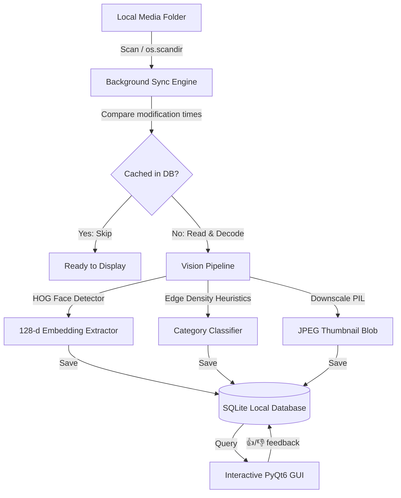

# 🔮 LIMO — Local Intelligent Media Organizer

[](https://microsoft.com)
[](https://python.org)
[](https://www.riverbankcomputing.com/software/pyqt/)
[](https://opensource.org/licenses/MIT)
[](https://github.com)

A premium, privacy-focused desktop utility designed to index, organize, filter, and search your personal photo library entirely offline. LIMO leverages local computer vision models, heuristics, and reinforcement learning loops to cluster faces and auto-categorize media without ever connecting to the internet.

---

## 🌟 Key Features

*   **🧠 Local Face Recognition**: Extracts and compares $128$-dimensional face embeddings using local HOG-based models ($0\%$ cloud footprint).
*   **👍 Reinforcement Feedback Loops**: Rating a low-confidence match (👍/👎) expands the reference template cluster dynamically or blacklists the face from results.
*   **👥 Face-Count Auto-Categorization**: Heuristically classifies photos into Portrait ($1$ face), Couple ($2$ faces), Group ($3+$ faces), and Landscape ($0$ faces, with sky/nature color profile checks).
*   **🔄 Reinforcement Override Learning**: Remembers manual category corrections and normalizes features (aspect ratio, face count, skin percentages, line/text counts, and sky/nature percent) to dynamically override future classifications of similar photos.
*   **🧠 Explorer Multi-Selection**: Left-click to select multiple image tiles with a beautiful glowing highlight. Right-click to change the category for all selected photos in bulk.
*   **📂 Yellow Directory Navigation**: Switch between flat library grids and yellow grouped folder cards showing file counts. Navigate directories with natural double-clicks.
*   **🎨 Tactile Hover highlights**: Interactive color-shifted hover animations for Pills, folder tiles (gold), navigation buttons (grey), and image tiles (purple).
*   **⚡ Real-Time Incremental Loader**: Replaced full-screen loading modals with a QTimer-based progressive batch loader rendering images in real-time, keeping the UI thread fluid.
*   **🔄 Live Scan Refreshing**: Autosync and live refresh during folder scans showing photos in the grid in real-time.
*   **📥 System Tray Minimization**: Minimizing LIMO docks it safely to your Windows system tray, displaying notification bubbles for auto-index completions.
*   **⚡ Windows Unicode Resilient**: Fully supports spaces, non-ASCII characters, and emojis in system paths via memory buffer encoding.
*   **🔒 Resource Constrained**: Keeps peak RAM usage under $500\text{MB}$ via automatic thumbnailing and input downscaling.

---

## ⚙️ Architecture & Technical Highlights



### 1. Vectorized Search Matching (Reinforced Clustering)
When a user clicks 👍 (Thumbs Up) on a low-confidence match (< 60% confidence), that face's vector is appended as an additional search template. Distance queries calculate the minimum Euclidean distance between the target and all active templates in a single broadcasted NumPy pass:
$$\text{Distance}_{i} = \min_{j} \left( \sqrt{\sum (V_{i} - T_{j})^2} \right)$$
When a user clicks 👎 (Thumbs Down), the face is blacklisted, immediately excluding it from results.

### 2. Auto-Categorization Heuristics
Media files are classified dynamically based on a multi-feature computer vision pipeline:
-   **Portrait**: Triggered when $1$ or more faces are detected. Also includes a skin-tone fallback detector (operating in HSV space) looking at the central concentration of skin pixels, helping to capture people photos even if faces are tilted, turned away, or partially obscured.
-   **Documents**: Scanned for substantial blocks of text. Edge contours are extracted via Canny filtering and then horizontally closed with a wide morphological kernel to merge characters into lines. If 5 or more text-like contours are found, it is classified as a Document.
-   **Landscape**: Triggered for wide aspect ratio images ($w/h \ge 1.2$). It divides the top $30\%$ of the image into three horizontal segments and checks for continuous sky smoothness (low edge density) and blue/white sky color profile. If there are continuous sky columns and nature colors (green/brown) in the bottom $70\%$, it classifies as a Landscape. This prevents people standing in the frame from triggering false landscapes.

### 3. Progressive Real-time Loading & Multi-Selection
LIMO implements a QTimer-based progressive loader that renders images in batches of 15 tiles every 15ms. Bypassing heavy synchronous loops, it keeps the GUI thread fully responsive and allows media files to stream into view in real-time as they load.
It supports Explorer-style multi-selection where left-clicks toggle selection state, updating a dynamic count in the sidebar status and enabling bulk category modifications via right-click context menus.

---

## 🚀 Getting Started

### 📋 Prerequisites
-   **Python 3.12+**
-   **Windows C++ Build Tools** (Required to compile `dlib` during installation)

### 🔧 Installation

1.  **Clone this repository** (or download the source directory).
2.  **Create and activate a virtual environment**:
    ```powershell
    python -m venv .venv
    .venv\Scripts\activate
    ```
3.  **Install dependencies**:
    ```powershell
    pip install -r requirements.txt
    ```

### 💻 Running the Application
Launch LIMO from your active shell:
```powershell
python limo_project/main.py
```

### 📦 Building the Windows Installer

Requires [Inno Setup 6](https://jrsoftware.org/isinfo.php) installed, plus the venv from above with `pyinstaller` installed (`pip install pyinstaller`).

From the project root, in PowerShell:
```powershell
# 1. Build the app exe via the project venv (use the venv's python, not a global
#    install — a global Python environment with unrelated heavy packages can
#    bloat the build by bundling things LIMO doesn't need)
Remove-Item -Recurse -Force build, dist -ErrorAction SilentlyContinue
.venv\Scripts\python.exe -m PyInstaller --noconfirm LIMO.spec

# 2. Copy the freshly built exe into the installer folder
Copy-Item dist\LIMO.exe installer\LIMO.exe -Force

# 3. Compile the installer with Inno Setup (adjust the path to wherever ISCC.exe is installed)
& "C:\Program Files (x86)\Inno Setup 6\ISCC.exe" installer\limo.iss
```
The final installer is written to `installer\LIMO_Setup.exe` — that single file is all you need to distribute a release.

If `installer/logo.png` changes, regenerate the derived icon/wizard images first:
```powershell
.venv\Scripts\python.exe scratch\create_icons.py
```
This produces `logo.ico`, `wizard.bmp`, and `wizard_small.bmp` in `installer/`, which `limo.iss` and `LIMO.spec` reference.

### 🖱️ User Instructions
1.  **Select Media Folder**: Go to **Setup -> Select Media Folder...** in the menu bar to set up your directory path and start indexing.
2.  **Toggle Views**: Use the **Library** pill for a flat view of all images, or **Folders** for relative subdirectory browsing.
3.  **Perform Face Searches**: Drag & drop or click the face drop zone to select a reference profile image. Adjust the **Strictness Tolerance** slider to expand/refine results.
4.  **Refine Search Models**: Press 👍 or 👎 on images with lower confidence scores to train the local multi-reference cluster.
5.  **Minimize to Tray**: Closing/minimizing the window docks the interface into your Windows system tray. Double-click the tray icon to restore the application.

---

## 📁 Repository Structure

*   `limo_project/`
    *   `engine/`
        *   `database.py` — Local SQLite relational DB manager with Cascade-Delete logic.
        *   `vision_core.py` — Traversal generator, downscaling calculations, and face distance models.
    *   `ui/`
        *   `main_window.py` — Main PyQt6 application UI, layouts, pills, sorting, and event filters.
    *   `tests/`
        *   `test_vision_core.py` — Pytest suite covering categorizations, caching, sorting, and reinforcement feedback.
    *   `main.py` — App bootstrap file.
*   `LICENSE` — MIT License.

---

## 📄 License
This project is licensed under the MIT License - see the [LICENSE](LICENSE) file for details.
