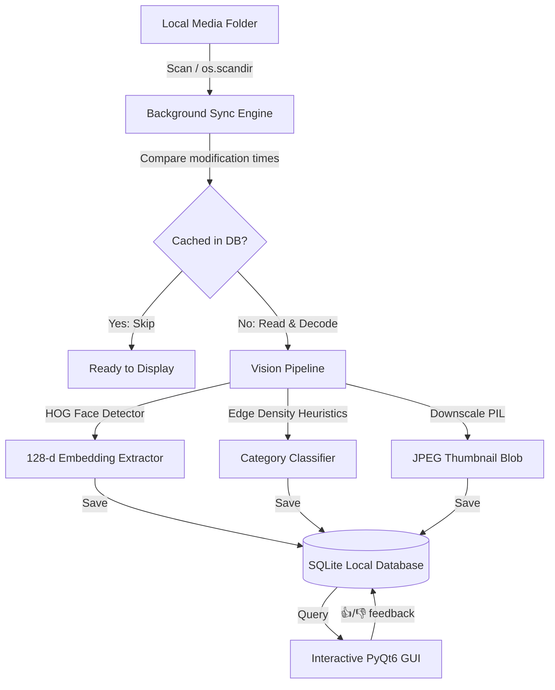

# 🔮 LIMO — Local Intelligent Media Organizer

[](https://microsoft.com)
[](https://python.org)
[](https://www.riverbankcomputing.com/software/pyqt/)
[](https://opensource.org/licenses/MIT)
[](https://github.com)

A premium, privacy-focused desktop utility designed to index, organize, filter, and search your personal photo library entirely offline. LIMO leverages local computer vision models, heuristics, and reinforcement learning loops to cluster faces and auto-categorize media without ever connecting to the internet.

---

## 🌟 Key Features

*   **🧠 Local Face Recognition**: Extracts and compares $128$-dimensional face embeddings using local HOG-based models ($0\%$ cloud footprint).
*   **👍 Reinforcement Feedback Loops**: Reinforce or blacklist matches. Rating a low-confidence search result expands the reference template cluster dynamically or adds the face to a search-specific blacklist.
*   **🔄 Background Sync & Dashboard**: Automatically scans directory changes every 3 minutes. Includes real-time dashboard controls to **Pause**, **Resume**, or **Cancel** scanning threads.
*   **📂 Yellow Directory Navigation**: Switch between flat library grids and grouped folder cards showing file counts. Navigate directories with natural double-clicks.
*   **🎨 HSL-Tailored Dark Mode UI**: Built with a sleek, translucent dark aesthetic (`#1e1e24`, `#6c5ce7`) featuring responsive item cards, hover micro-animations, and self-centering loading overlays.
*   **📥 System Tray minimization**: Minimizing LIMO docks it safely to your Windows system tray, displaying notification bubbles for auto-index completions.
*   **⚡ Windows Unicode Resilient**: Fully supports spaces, non-ASCII characters, and emojis in system paths via memory buffer encoding.
*   **🔒 Resource Constrained**: Keeps peak RAM usage under $500\text{MB}$ via automatic thumbnailing and input downscaling.

---

## ⚙️ Architecture & Technical Highlights



### 1. Vectorized Search Matching (Reinforced Clustering)
When a user clicks 👍 (Thumbs Up) on a low-confidence match (< 60% confidence), that face's vector is appended as an additional search template. Distance queries calculate the minimum Euclidean distance between the target and all active templates in a single broadcasted NumPy pass:
$$\text{Distance}_{i} = \min_{j} \left( \sqrt{\sum (V_{i} - T_{j})^2} \right)$$
When a user clicks 👎 (Thumbs Down), the face is blacklisted, immediately excluding it from results.

### 2. Auto-Categorization Heuristics
Media files are classified dynamically based on structural traits:
-   **Portrait**: $1$ to $2$ detected faces.
-   **Group**: $3$ or more detected faces.
-   **Screenshot**: High Sobel edge density (captures text/UI grids).
-   **Landscape**: Landscape ratio with no detected faces.

### 3. Self-Centering Loading Overlay
A custom semi-transparent `LoadingOverlay` intercepts the window's layout coordinates and handles parent `QEvent.Type.Resize` events via an event filter. It utilizes `WA_StyledBackground` to draw dark, glassy cover overlays dynamically centering its spinner container.

---

## 🚀 Getting Started

### 📋 Prerequisites
-   **Python 3.12+**
-   **Windows C++ Build Tools** (Required to compile `dlib` during installation)

### 🔧 Installation

1.  **Clone this repository** (or download the source directory).
2.  **Create and activate a virtual environment**:
    ```powershell
    python -m venv .venv
    .venv\Scripts\activate
    ```
3.  **Install dependencies**:
    ```powershell
    pip install -r requirements.txt
    ```

### 💻 Running the Application
Launch LIMO from your active shell:
```powershell
python limo_project/main.py
```

### 🖱️ User Instructions
1.  **Select Media Folder**: Go to **Setup -> Select Media Folder...** in the menu bar to set up your directory path and start indexing.
2.  **Toggle Views**: Use the **Library** pill for a flat view of all images, or **Folders** for relative subdirectory browsing.
3.  **Perform Face Searches**: Drag & drop or click the face drop zone to select a reference profile image. Adjust the **Strictness Tolerance** slider to expand/refine results.
4.  **Refine Search Models**: Press 👍 or 👎 on images with lower confidence scores to train the local multi-reference cluster.
5.  **Minimize to Tray**: Closing/minimizing the window docks the interface into your Windows system tray. Double-click the tray icon to restore the application.

---

## 📁 Repository Structure

*   `limo_project/`
    *   `engine/`
        *   `database.py` — Local SQLite relational DB manager with Cascade-Delete logic.
        *   `vision_core.py` — Traversal generator, downscaling calculations, and face distance models.
    *   `ui/`
        *   `main_window.py` — Main PyQt6 application UI, layouts, pills, sorting, and event filters.
    *   `tests/`
        *   `test_vision_core.py` — Pytest suite covering categorizations, caching, sorting, and reinforcement feedback.
    *   `main.py` — App bootstrap file.
*   `LICENSE` — MIT License.

---

## 📄 License
This project is licensed under the MIT License - see the [LICENSE](LICENSE) file for details.
